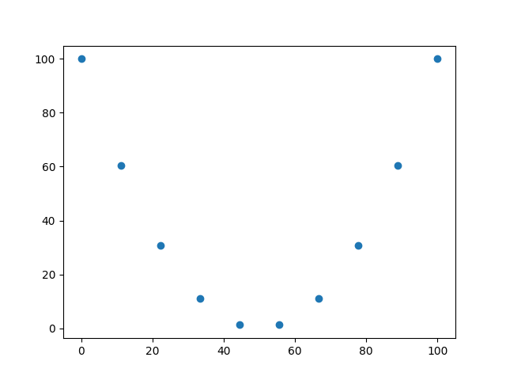
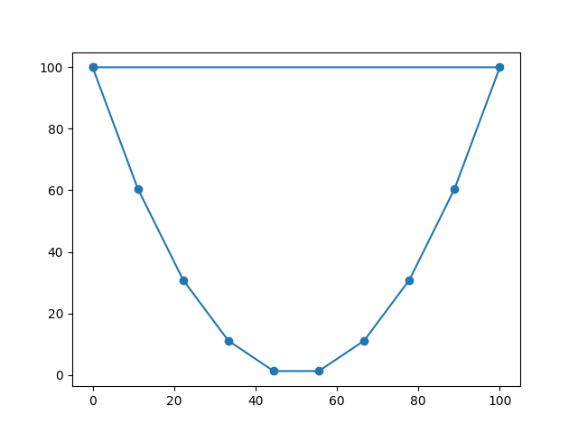

### Problem generator and Solution Plotter for the [Travelling Salesman](https://github.com/damonf/travelling_salesman) project.


## Sample Usage: Generating a Problem

```bash
# Generate a problem (an arc with 10 points):
poetry run python ./src/tsp_plotter/main.py create -a 10

```
This will generate three files:

- _graph.txt_ - an adjacency matrix of distances between the points in the problem
- _problem.txt_ - the coordinates of the points in the problem
- _problem.png_ - the problem plotted graphically

The _-a_ option specifies an arc.  This is usefull for evaluating the correctness of the solution, since it's easy to see if a path is the shortest path.

Generated problems can be solved by the [Travelling Salesman](https://github.com/damonf/travelling_salesman) program which takes the graph.txt file as input.

Here is the generated _problem.png_ for the sample usage:




## Sample Usage: Plotting a Solution

```bash
# Plot a solution to a problem:
poetry run python ./src/tsp_plotter/main.py plot solution.txt problem.txt

```
The input files are:

- _solution.txt_ - the indices of the points in the solution path (shortest path)
- _problem.txt_ - the coordinates of the points in the problem

This will generate the _solution.png_ file, a graphical representation of the solution path.

Solution files can be obtained from the [Travelling Salesman](https://github.com/damonf/travelling_salesman) program.

Here is what the _solution.png_ file for our sample might look like:



## License

[GNU General Public License v3.0](https://choosealicense.com/licenses/gpl-3.0/)

